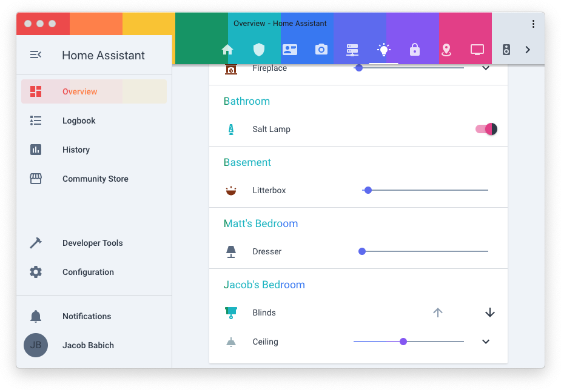
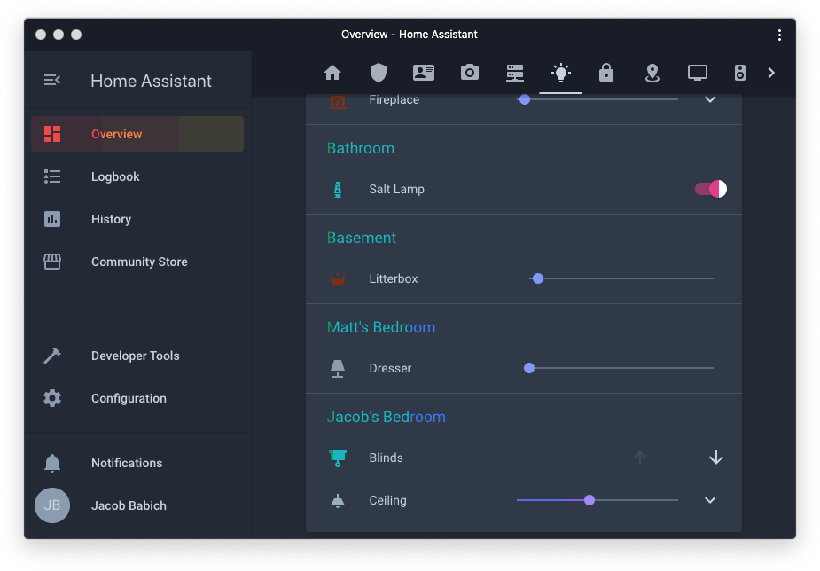

<h1 align="center">🎨 Home Assistant Tailwind CSS Themes</h1>

## ❓ What is this?
This is a collection of 10 colored themes with light and dark variants, built from the [Tailwind CSS](https://tailwindcss.com/) color palette, for Home Assistant (Core) (0.108+).

<table align="center">
  <tr>
    <td style="color: white; background-color: #f05252;">Red</td>
    <td style="color: white; background-color: #ff8a4c;">Orange</td>
    <td style="color: white; background-color: #faca15;">Yellow</td>
    <td style="color: white; background-color: #0e9f6e;">Green</td>
    <td style="color: white; background-color: #16bdca;">Teal</td>
  </tr>
    <td style="color: #364152; background-color: #e2e8f0;">Gray</td>
    <td style="color: white; background-color: #e74694;">Pink</td>
    <td style="color: white; background-color: #9061f9;">Purple</td>
    <td style="color: white; background-color: #6875f5;">Indigo</td>
    <td style="color: white; background-color: #3f83f8;">Blue</td>
  </tr>
</table>

## 🖼 Preview
### ☀️ Light

### 🌑 Dark

*View screenshots individually in the `screenshots` folder of this repository.*

## 📋 Copy
Copy the **entire** contents of `themes.yaml` into somewhere Home Assistant (Core) reads your configuration. 
This means you could give it its own file in your `packages` directory, or you could put it directly in the root `configuration.yaml` file, or whatever is most appropriate for your setup.

Restart Home Assistant (Core) and verify that the `tailwind-light-blue` and `tailwind-dark-blue` themes are correctly usable. You can then remove any other theme you don't want to use, as long as these two stay. 

⚠️ Be aware that dark theme variants are dependent on their light theme variant, so for example you cannot delete `tailwind-light-orange` and keep `tailwind-dark-orange` unless you move the `orange_theme` block to where it's referenced (`<<: *orange_theme`).

## 🛠 Usage
You can access the Tailwind color variables like `var(--red-500)` wherever a color is expected in Lovelace, such as in CSS `style` blocks from [`card-mod`](https://github.com/thomasloven/lovelace-card-mod/). 

These themes are all built exclusively using a new color palette that is planned for the next major Tailwind CSS release. For this reason, [the palette currently listed in the official documentation](https://tailwindcss.com/docs/customizing-colors#default-color-palette) is referred to as `classic` in this set of themes and can be referenced like `var(--classic-purple-300)`. 

You can customize the font everywhere with `primary-font-family` in the `&fonts` block.

Consider using the `frontend.set_theme` service to set your preferred theme for everyone. You can also write automations to change the theme to a dark variant at night, for example.

## 😵 Help! I have a question
[Create an issue](https://github.com/babichjacob/home-assistant-tailwind-themes/issues/new) and I'll try to help.

## 😡 Fix! There is something that needs improvement
[Create an issue](https://github.com/babichjacob/home-assistant-tailwind-themes/issues/new) or [pull request](https://github.com/babichjacob/home-assistant-tailwind-themes/pulls) and I'll try to fix.

## 📄 License
MIT

***
_This README was generated with ❤️ by [readme-md-generator](https://github.com/kefranabg/readme-md-generator)_

_Repository preview image generated with [GitHub Social Preview](https://social-preview.pqt.dev/)_
